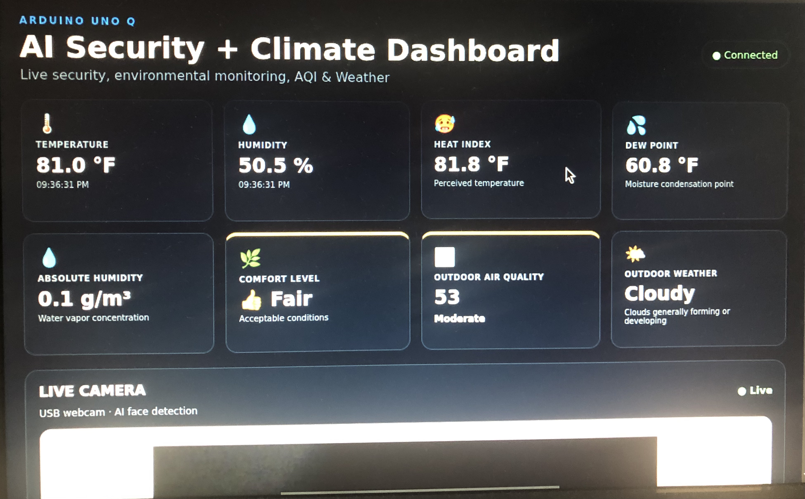
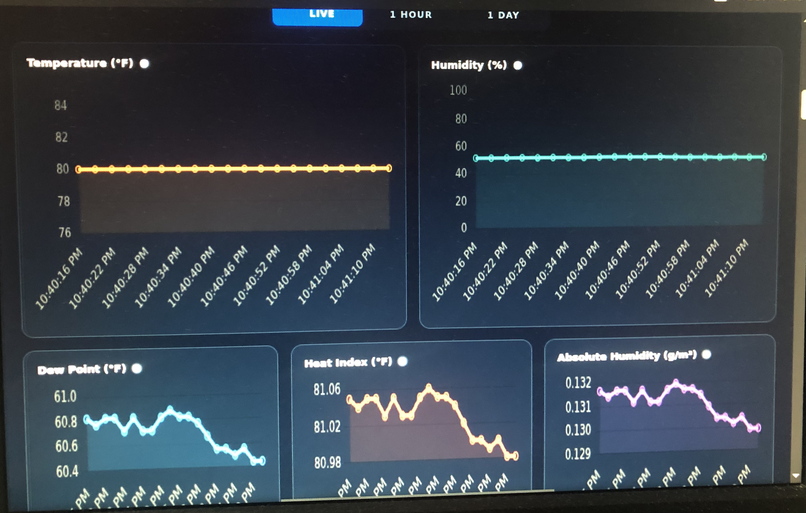
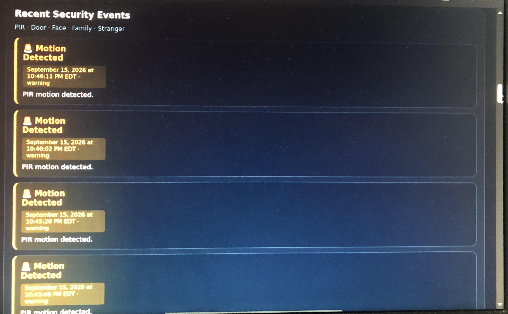

# ⚡ HomeMind

**An AI-powered smart home monitoring and security system built on the Arduino UNO Q platform.**

HomeMind unifies environmental sensing, motion/door security, AI-powered face recognition, outdoor air quality & weather monitoring, and Telegram notifications into a single, elegant dashboard — all running on the Arduino UNO Q's dual-brain (MCU + Linux) architecture.

👉 Live Demo: https://williaml12.github.io/HomeMind/

## Showcase the website
### 8 Climate Metric Cards


### Charts with tabs — Live / 1 Hour / 1 Day for all five climate metrics


### Real-time security event feed with images, severity colors, and confidence

---

## 📖 Overview

HomeMind combines an **Arduino sketch** (running on the MCU) with a **Python application** (running on the Linux side) that communicate seamlessly through the Arduino Router Bridge. The system:

- 🌡️ Monitors **indoor temperature & humidity** via a DHT11 sensor
- 🚨 Detects **motion** via PIR sensor and **door open/close** events
- 📸 Uses a **USB webcam + AI classification** to distinguish **family members from strangers**
- 🌫️ Fetches **outdoor Air Quality Index (AQI)** and **weather forecasts**
- 🖥️ Displays **AQI and weather** on the built-in **LED Matrix**
- 📲 Sends **Telegram alerts** for motion, door events, temperature/humidity alerts, and stranger detections
- 📊 Provides a **real-time web dashboard** with charts, live camera feed, and security event log

---
Find more about **🎙️ Local Edge AI Voice Assistant** include code and setup for the bricks:

Local Edge AI Voice Assistant (Kokoro TTS & ASR local Edition): https://github.com/williaml12/Local-Edge-AI-Voice-Assistant

---

## ✨ Features

### 🏠 Environmental Monitoring
- DHT11 temperature & humidity readings every 3 seconds
- Heat Index, Dew Point, and Absolute Humidity calculations
- Comfort Level scoring (Excellent → Bad)
- Temperature trend tracking (📈 Rising / 📉 Falling / ➡️ Stable)
- Hourly comfort reports via Telegram

### 🛡️ Security System
- PIR motion detection with LED indicator
- Door sensor (open/closed) with LED indicator
- System Arm/Disarm control
- AI-powered face classification: **Family** vs **Stranger**
- Stranger snapshot capture & Telegram photo alerts
- Security event log with severity levels (Critical / Warning / Info)

### 🌍 Outdoor Environment
- Real-time AQI from WAQI API
- Weather forecast (sunny, cloudy, rainy, snowy, foggy)
- LED Matrix visual display for both

### 📱 Telegram Bot Commands

| Command | Description |
|---------|-------------|
| `/start` | Enable notifications & show help |
| `/stop` | Disable notifications |
| `/temp` | Current temperature |
| `/humidity` | Current humidity |
| `/heatindex` | Heat index + trend |
| `/comfort` | Full comfort status |
| `/motion` | PIR motion status |
| `/door` | Door status |
| `/status` | Full system status |
| `/buzzer` | Buzzer state |
| `/motionledon` / `/motionledoff` | Control Motion LED |
| `/report` | Trigger hourly report |
| `/help` | Show commands |

### 🖥️ Web Dashboard
- Live climate metric cards (8 metrics)
- Chart.js-powered graphs (Live / 1H / 24H views)
- Embedded live camera stream
- Security control switches (Arm, LED, Notifications)
- Color-coded security event feed with face snapshots

---

## 🧰 Hardware Requirements

| Component | Pin | Notes |
|-----------|-----|-------|
| DHT11 Sensor | D2 | Temperature + Humidity |
| Motion LED | D3 | Motion indicator |
| Door LED | D4 | Door indicator |
| Buzzer | D5 | Alarm (Armed + Door Open) |
| PIR Motion Sensor | D8 | Digital input |
| Door Sensor | D9 | `INPUT_PULLUP` (HIGH = OPEN) |
| LED Matrix | Q1/Q2 | Built-in on UNO Q |
| USB Webcam | — | For AI face detection |

---

## 🏗️ Architecture

```
┌─────────────────────────────────────────────────────────┐
│                    Arduino UNO Q                        │
│                                                         │
│  ┌──────────────┐         ┌─────────────────────────┐   │
│  │   MCU Side   │◄───────►│      Linux Side         │   │
│  │ (sketch.ino) │ Bridge  │      (main.py)          │   │
│  │              │         │                         │   │
│  │ • DHT11      │         │ • Bridge callbacks      │   │
│  │ • PIR        │         │ • Telegram bot          │   │
│  │ • Door       │         │ • WebUI + Socket.IO     │   │
│  │ • LEDs       │         │ • AI Face Detection     │   │
│  │ • LED Matrix │         │ • AQI / Weather API     │   │
│  │ • Bridge     │         │ • TimeSeriesStore (DB)  │   │
│  └──────────────┘         └─────────────────────────┘   │
└─────────────────────────────────────────────────────────┘
```

The MCU **pushes** sensor events to Python via `Bridge.notify()`, and Python **calls** MCU functions via `Bridge.call()` for LED control and outdoor data retrieval.

---

## 📂 Project Structure

```
HomeMind/
├── sketch/
│   ├── sketch.ino              # Arduino MCU firmware
│   ├── air_quality_frames.h    # LED Matrix frames for AQI
│   └── weather_frames.h        # LED Matrix animation frames
├── python/
│   └── main.py                 # Python bridge + dashboard backend
├── assets/
│   ├── index.html              # Dashboard UI
│   ├── app.js                  # Frontend logic
│   ├── style.css               # Styling
│   ├── libs/
│   │   ├── socket.io.min.js
│   │   └── arduino.js
│   └── img/
│       ├── info.svg
│       └── nodata.svg
├── data/
│   ├── sensor_history.csv      # Auto-generated
│   └── security_events.json    # Auto-generated
├── snapshots/                  # Stranger face snapshots
└── README.md
```

---

## 🚀 Getting Started

### 1. Prerequisites

- **Arduino UNO Q** board
- **Arduino App Lab** environment installed
- USB webcam
- Python 3.10+ (bundled with UNO Q's Linux side)
- A Telegram bot token (from [@BotFather](https://t.me/BotFather))
- A WAQI API token (free at [aqicn.org](https://aqicn.org/data-platform/token/))

### 2. Configure Credentials

In `python/main.py`, replace the placeholders:

```python
BOT_TOKEN = "YOUR_BOT_TOKEN"
CHAT_ID   = "YOUR_CHAT_ID"
API_TOKEN = "demo"  # Replace with your WAQI token
CITY      = "Brooklyn"  # Change to your city
```

### 3. Install Python Dependencies

```bash
pip install requests urllib3 pillow arduino-app-utils
```

### 4. Flash the MCU

Open `sketch/sketch.ino` in Arduino App Lab and upload it to the UNO Q.

### 5. Run the Python App

```bash
python python/main.py
```

The WebUI will be available at `http://<board-ip>:<port>/`.

---

## 🔌 Bridge API Reference

### MCU → Python (PUSH via `Bridge.notify`)

| Function | Arguments | Description |
|----------|-----------|-------------|
| `on_environment` | `temperature, humidity` | DHT11 readings |
| `record_sensor_samples` | `temperature, humidity` | Climate dashboard data |
| `on_pir` | `bool` | Motion state change |
| `on_door` | `bool` | Door state change |

### Python → MCU (CALL via `Bridge.call`)

| Function | Arguments | Returns |
|----------|-----------|---------|
| `get_air_quality` | — | AQI level string |
| `get_weather_forecast` | `city` | Weather category |
| `set_security_led` | `bool` | Status string |
| `set_led_command` | `"ON"` / `"OFF"` | Status string |
| `get_led_state` | — | `"on"` / `"off"` |
| `get_motion_status` | — | Full motion status |
| `get_door_status` | — | Full door status |
| `get_temperature_status` | — | Temp + humidity string |
| `set_door_led` | `"ON"` / `"OFF"` | LED state |

---

## 📊 Data Storage

- **`sensor_history.csv`** — Rolling log of temperature & humidity (max 1000 entries)
- **`security_events.json`** — Last 50 security events with images (base64 JPEG)
- **`TimeSeriesStore`** — In-memory database for chart data (temperature, humidity, dew point, heat index, absolute humidity)
- **`stranger_snapshots/`** — Full-resolution stranger face crops

---

## 🎨 LED Matrix Behavior

| Trigger | Display |
|---------|---------|
| AQI = Good / Moderate / Unhealthy / … | Static frame (5s) |
| Weather = sunny / cloudy / snowy / foggy | Animated sequence (×5) |
| Weather = rainy | Animated sequence (×10) |
| Unknown weather | Warning message |

Updates every **5 minutes** by default (`ENVIRONMENT_INTERVAL`).

---

## 🔔 Notification Logic

| Event | Trigger | Cooldown |
|-------|---------|----------|
| Motion alert | PIR HIGH (first time) | 3s |
| Door alert | Door state change | — |
| High temp alert | > 35 °C | Until temp drops |
| High humidity alert | > 80 % | Until humidity drops |
| Stranger detected | Classification ≥ 80% | 5s (per motion) |
| Hourly report | Every 60 min | — |

> Notifications can be globally disabled via WebUI toggle or `/stop` command.

---

## 🛠️ Configuration Constants

```python
CAMERA_WIDTH = 640
CAMERA_HEIGHT = 480
FACE_CONFIDENCE = 0.60          # Face detection threshold
CLASSIFICATION_THRESHOLD = 0.80 # Family/Stranger confidence
MOTION_COOLDOWN = 3.0           # Seconds between motion alerts
REPORT_INTERVAL_SECONDS = 3600  # Hourly report
TEMP_ALERT_C = 35.0
HUMIDITY_ALERT = 80.0
```

---

## 🧪 Tech Stack

| Layer | Technology |
|-------|-----------|
| MCU Firmware | Arduino C++ (`Arduino_RouterBridge`, `DHT`, `Arduino_LED_Matrix`) |
| Backend | Python 3 · `arduino-app-utils` · Flask (via WebUI) |
| AI | `VideoObjectDetection` + `ImageClassification` |
| Frontend | HTML5 · CSS3 · Vanilla JS · Chart.js · Socket.IO |
| APIs | WAQI (AQI) · `WeatherForecast` brick (weather) |
| Notifications | Telegram Bot API (async, queue-based) |
| Storage | CSV + JSON + `TimeSeriesStore` |

---

## 🐛 Troubleshooting

**DHT11 reads fail intermittently** → Ensure a 10kΩ pull-up resistor between DATA and VCC; keep wires short.

**Telegram messages not sending** → Verify `BOT_TOKEN` and `CHAT_ID`; check `telegram_configured()` returns `True` in logs.

**Camera not streaming** → Confirm `/dev/video0` exists and the iframe URL matches your board's IP on port `4912`.

**Face classification always "Uncertain"** → Retrain the classification model or lower `CLASSIFICATION_THRESHOLD`.

**No AQI data** → The `demo` token has strict rate limits. Register a free token at [aqicn.org](https://aqicn.org/data-platform/token/).

---

## 🗺️ Roadmap

- [ ] MQTT support for Home Assistant integration
- [ ] Local face embedding storage (no cloud)
- [ ] Voice assistant integration
- [ ] Mobile PWA version of the dashboard
- [ ] Multi-camera support
- [ ] SD card logging

---

## 📄 License

MIT License — see [`LICENSE`](LICENSE) for details.

---

## 🙏 Acknowledgements

- [Arduino](https://www.arduino.cc/) for the UNO Q platform
- [WAQI](https://aqicn.org/) for air quality data
- [Chart.js](https://www.chartjs.org/) for beautiful charts
- [Telegram Bot API](https://core.telegram.org/bots/api) for notifications

---

## 👤 Author

**William Lu** — [@yourhandle](https://github.com/williaml12)

> ⚡ *HomeMind — because your home should think for itself.*


